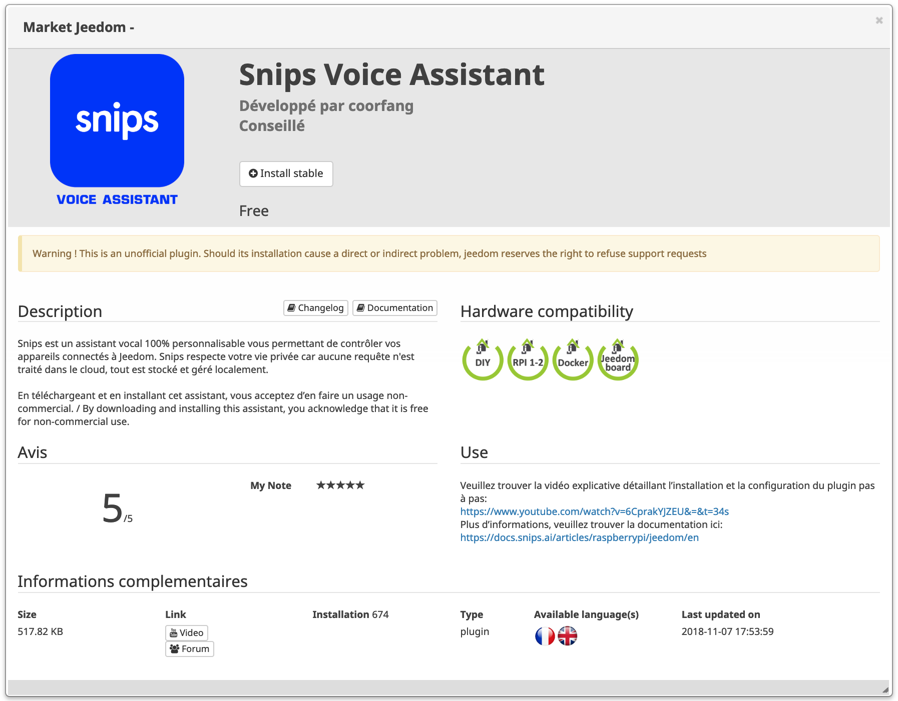

[](https://github.com/snipsco/snips-jeedom-plugin/blob/master/LICENSE)
[](https://github.com/snipsco/snips-jeedom-plugin/blob/master/CHANGE_LOG.md)

# snips-jeedom-plugin

This is the official Snips plugin designed for [Jeedom](https://www.jeedom.com/) home automation platform.

This plugin comes with an user-friendly visual interface, which allows Jeedom user to bind their connected device action with Snips voice assistant.

## User Guide

Please reach ***[Snips Dev Center](https://docs.snips.ai/)*** for the user documentation.

- ***[English Version](https://docs.snips.ai/articles/raspberrypi/jeedom/en)***

## Installation

### From Jeedom Plugin Market

<p align="center">
    
</p>

### Manual Installation

**Step 1**

Clone this repository onto your target device which holds Jeedom software:

```bash
git clone https://github.com/snipsco/Snips-Jeedom-Plugin.git
```

**Step 2**

Move source to Jeedom plugin directory:

```bash
sudo mv snips-jeedom-plugin/ /var/www/html/plugins/snips/
```

**Step 3**

Change permission to `775`:

```bash
sudo chmod -R 775 /var/www/html/plugins/snips/
```

Change user group to `www-data`:

```bash
sudo chgrp -R www-data /var/www/html/plugins/snips/
```

Change ownership to `www-data`:

```bash
sudo chown -R www-data /var/www/html/plugins/snips/
```

**Step 4**

Open Jeedom plugin management page, select `snips`. Then activate plugin and install dependancy.

Once the deamon is successfully launched, Snips plugin is ready to fly.

## Contributing

Please see the [Contribution Guidelines](https://github.com/snipsco/Snips-Jeedom-Plugin/blob/master/CONTRIBUTING.md).

## Copyright

This library is provided by [Snips](https://www.snips.ai) as Open Source software. See [LICENSE](https://github.com/snipsco/Snips-Jeedom-Plugin/blob/master/LICENSE) for more information.
